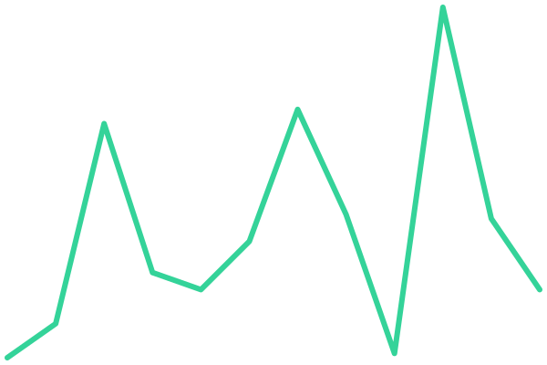

# [tempus.build status](https://status.tempus.build)

Public uptime monitor and status page for [tempus.build](https://tempus.build),
powered by [Upptime](https://upptime.js.org) — it runs entirely on GitHub Actions
(checks), Issues (incidents), and Pages (the site). No server.

Edit [`.upptimerc.yml`](./.upptimerc.yml) to change what is monitored.

## Maintaining the workflows

The workflows under `.github/workflows/` began as Upptime's generated template but are now
**hand-maintained**: auto-regeneration is removed and every action is **pinned by commit
SHA** (Renovate bumps them). Don't run `upptime update-template` — it regenerates the files
and drops the pins.

Each run mints a short-lived token from the `tempus-status` GitHub App, scoped per workflow
to the least privilege it needs (`contents: write`, plus `issues: write` for the uptime
checks), so the job's `GITHUB_TOKEN` stays `contents: read`. Every job is also guarded with
`if: github.ref == 'refs/heads/main'` and the `push` triggers are pinned to `branches: [main]`,
so a feature branch can never commit data or deploy to the live `gh-pages` site.

<!--start: status pages-->
<!-- This summary is generated by Upptime (https://github.com/upptime/upptime) -->
<!-- Do not edit this manually, your changes will be overwritten -->
<!-- prettier-ignore -->
| URL | Status | History | Response Time | Uptime |
| --- | ------ | ------- | ------------- | ------ |
|  [Landing](https://tempus.build/) | 🟩 Up | [landing.yml](https://github.com/tempusbuild/status/commits/HEAD/history/landing.yml) | 

 109ms
     
 | 

<a href="https://status.tempus.build/history/landing">100.00%</a>
    

<!--end: status pages-->
